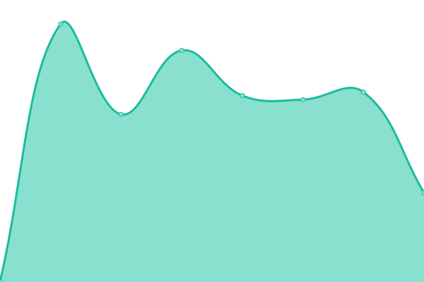

# [📈 Live Status](https://status.lostlink.net): <!--live status--> **🟧 Partial outage**

This repository contains the open-source uptime monitor and status page for [LostLink.Net](https://lostlink.net), powered by [Upptime](https://github.com/upptime/upptime).

With [Upptime](https://upptime.js.org), you can get your own unlimited and free uptime monitor and status page, powered entirely by a GitHub repository. We use [Issues](https://github.com/lostlink/upptime/issues) as incident reports, [Actions](https://github.com/lostlink/upptime/actions) as uptime monitors, and [Pages](https://status.lostlink.net) for the status page.

<!--start: status pages-->
<!-- This summary is generated by Upptime (https://github.com/upptime/upptime) -->
<!-- Do not edit this manually, your changes will be overwritten -->
<!-- prettier-ignore -->
| URL | Status | History | Response Time | Uptime |
| --- | ------ | ------- | ------------- | ------ |
|  [LostLink](https://lostlink.net) | 🟥 Down | [lost-link.yml](https://github.com/lostlink/upptime/commits/HEAD/history/lost-link.yml) | 

 152ms
     
 | 

<a href="https://status.lostlink.net/history/lost-link">0.00%</a>
    

|  [GUCanada](https://gucanada.com) | 🟩 Up | [gu-canada.yml](https://github.com/lostlink/upptime/commits/HEAD/history/gu-canada.yml) | 

 314ms
     
 | 

<a href="https://status.lostlink.net/history/gu-canada">100.00%</a>
    

|  [1001 Festas](https://1001festas.pt) | 🟩 Up | [1001-festas.yml](https://github.com/lostlink/upptime/commits/HEAD/history/1001-festas.yml) | 

 417ms
     
 | 

<a href="https://status.lostlink.net/history/1001-festas">100.00%</a>
    

|  [DotEnv](https://dotenv.ca) | 🟩 Up | [dot-env.yml](https://github.com/lostlink/upptime/commits/HEAD/history/dot-env.yml) | 

 156ms
     
 | 

<a href="https://status.lostlink.net/history/dot-env">100.00%</a>
    

<!--end: status pages-->

[**Visit our status website →**](https://status.lostlink.net)

## 📄 License

- Powered by: [Upptime](https://github.com/upptime/upptime)
- Code: [MIT](./LICENSE) © [LostLink.Net](https://lostlink.net)
- Data in the `./history` directory: [Open Database License](https://opendatacommons.org/licenses/odbl/1-0/)
